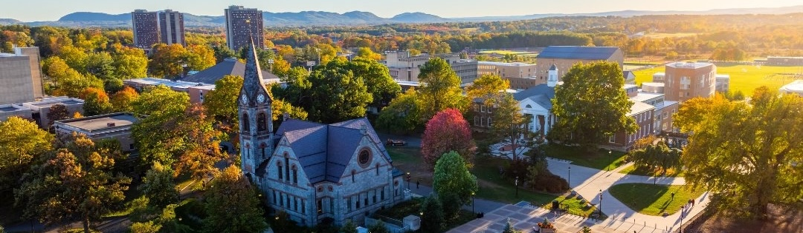

# Architectures for Resilient Computing Hardware [Research Lab]

Welcome to the **ARCH Research Lab** GitHub Page!  

Our lab rethinks computer architecture for emerging workloads that are memory-bound, stateful, and irregular, where conventional throughput-driven designs fall short. We develop predictable, efficient, and verifiable computing systems through rigorous microarchitectural design and hardware-software co-design. The lab is led by Prof. [Aruna Jayasena](https://github.com/archfx) and our work spans across AI hardware for large language model inference, acceleration of secure computation such as fully homomorphic encryption, and reconfigurable system software for managing heterogeneous accelerators, aiming to build high-performance platforms with strong guarantees of correctness, efficiency, and resilience.

This is the official space to manage artifacts related to different research projects of ARCH Lab!

---

